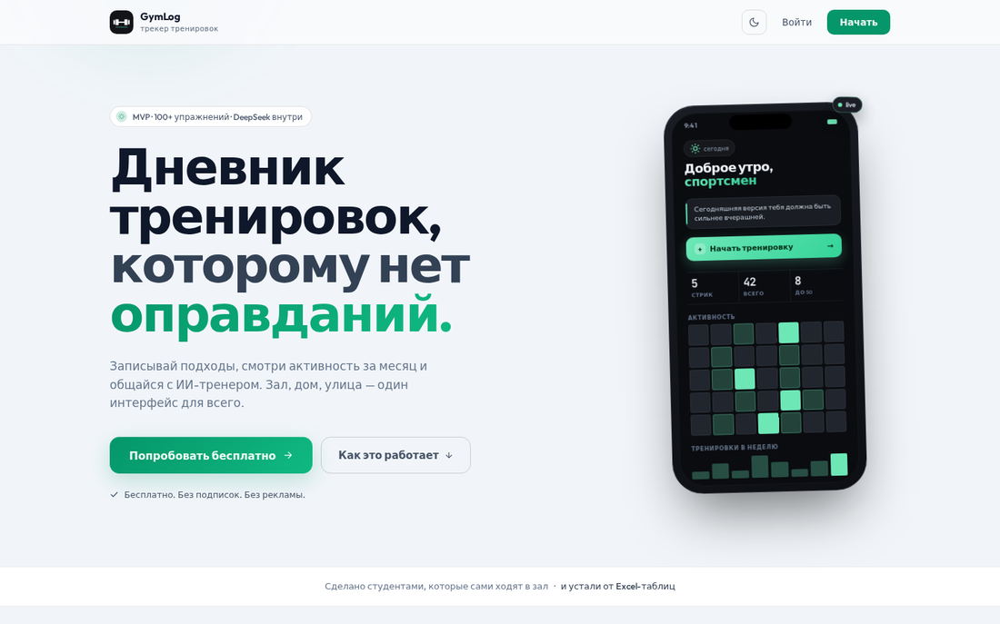
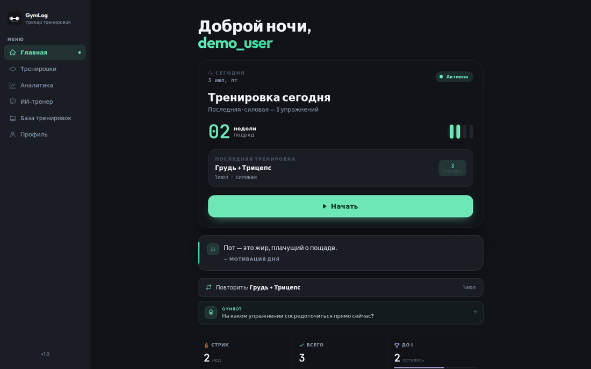
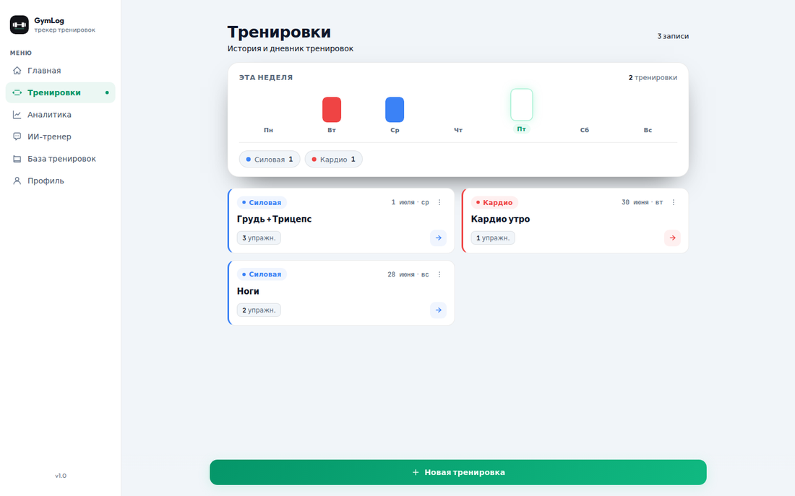
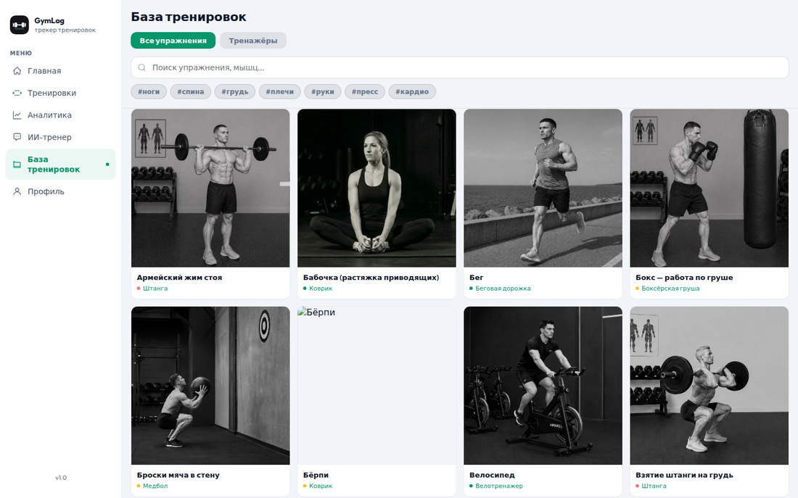
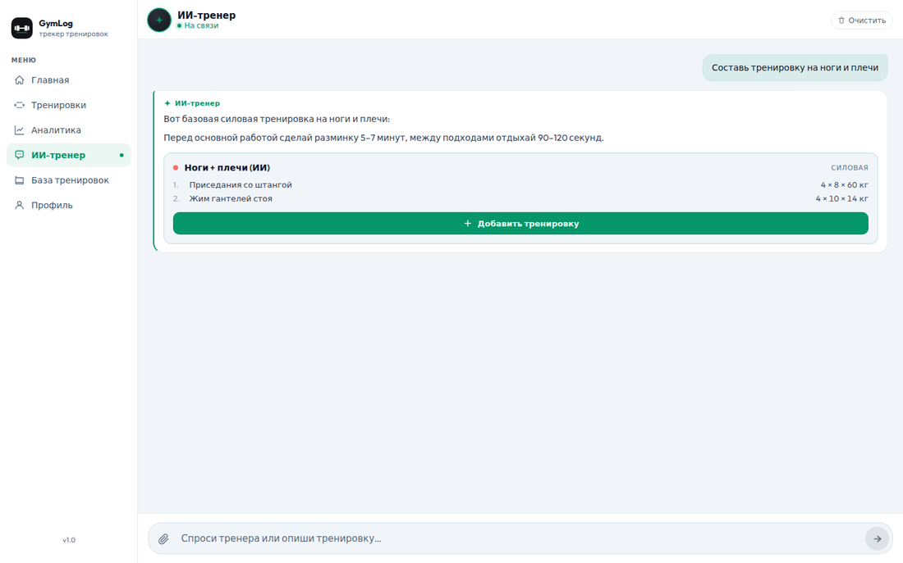
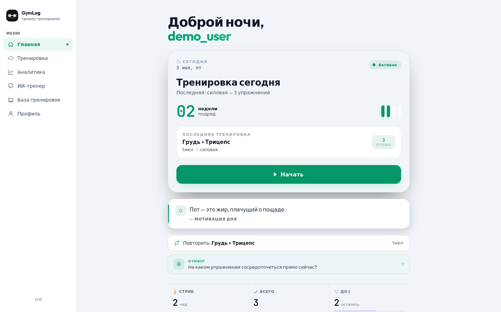

<div align="center">


# GymLog

**Дневник тренировок с ИИ-тренером**

Django REST Framework + React (Vite/TypeScript) · PWA · командный учебный проект

[](https://github.com/NexaProject-IRIT/gym-tracker/actions/workflows/ci.yml)


</div>

---

## О проекте

GymLog — трекер тренировок: ведёшь дневник подходов/повторов/весов, смотришь статистику и активность,
а ИИ-тренер на базе LLM (DeepSeek) составляет программу тренировок, разбирает технику
и анализирует прогресс прямо в чате. База знаний содержит 90+ упражнений и 40+ тренажёров с фото,
целевыми мышцами и описанием техники.

Сделан как проект по проектному практикуму (УрФУ, 4 семестр) командой из пяти человек за шесть
спринтов — от вёрстки макетов до ИИ-интеграции, деплоя на VPS и аудита безопасности/багов/качества кода.

## Скриншоты

<table>
<tr>
<td width="50%"><p align="center"><sub>Лендинг</sub></p></td>
<td width="50%"><p align="center"><sub>Главная (тёмная тема)</sub></p></td>
</tr>
<tr>
<td width="50%"><p align="center"><sub>Дневник тренировок</sub></p></td>
<td width="50%"><p align="center"><sub>База упражнений</sub></p></td>
</tr>
<tr>
<td width="50%"><p align="center"><sub>ИИ-тренер</sub></p></td>
<td width="50%"><p align="center"><sub>Главная (светлая тема)</sub></p></td>
</tr>
</table>

## Возможности

- **Дневник тренировок** — CRUD тренировок с упражнениями, подходами/повторами/весом, заметками, PR-отметками
- **ИИ-тренер** — чат с LLM: составление программы, разбор техники, анализ прогресса; ИИ может прямо
  в чате предложить тренировку и добавить её в дневник (`<workout>`/`<import>` разметка в ответе)
- **База упражнений** — 90+ упражнений и 40+ тренажёров с фото техники, картой целевых мышц, тегами
  и нечётким поиском (`rapidfuzz`)
- **Профиль и статистика** — рост/вес/возраст/цель, счётчики тренировок, экспорт истории в `.txt`
- **PWA** — устанавливается на телефон (Android/iOS) как приложение, работает в тёмной/светлой теме
- **JWT-аутентификация** с автоматическим рефрешем токена

## Технологии

| Слой | Стек |
|---|---|
| Frontend | React 19, TypeScript, Vite, React Router, `vite-plugin-pwa` |
| Backend | Django 4.2, Django REST Framework, `simplejwt`, `django-cors-headers` |
| БД | PostgreSQL 15 |
| ИИ | DeepSeek (LLM), парсинг `<workout>` из ответа |
| Инфра | Docker Compose, GitHub Actions (тесты + деплой на VPS) |
| Тесты | pytest / pytest-django (мок LLM, SQLite in-memory) |

## Быстрый старт

Всё поднимается через Docker Compose из корня репозитория:

```bash
docker compose up --build        # первый запуск / после изменения зависимостей
docker compose up                # последующие запуски
```

- Frontend: http://localhost:5173
- Backend API: http://localhost:8000
- PostgreSQL: localhost:5432

Нужен файл `.env` в корне (см. `.env.example`) — как минимум переменные Postgres и Django;
для ИИ-чата без реального ключа поставь `LLM_PROVIDER=mock`.

<details>
<summary>Локальная разработка без Docker</summary>

Backend (нужен запущенный Postgres):

```bash
cd backend
pip install -r requirements.txt
python manage.py migrate
python manage.py sync_knowledge_base   # загружает упражнения/тренажёры из knowledge_base/
python manage.py runserver
```

Frontend:

```bash
cd frontend
npm install
npm run dev      # dev-сервер с HMR на localhost:5173
npm run build    # проверка типов + сборка
npm run lint     # ESLint
```

</details>

## Тесты

```bash
cd backend
pytest --tb=short
```

Тесты используют in-memory SQLite и мок LLM-клиента — реальные ключи не нужны.

## Архитектура

Подробное описание модели данных, потока синхронизации базы знаний, роутов API и фронтенда,
а также историю спринтов и аудитов (security/bugs/code quality) — см. [`CLAUDE.md`](CLAUDE.md).

## Команда

Проектный практикум, УрФУ, 4 семестр.

| Участник | Роль |
|---|---|
| Насибулин Данила | тимлид, DevOps, тренировки/таймер, ИИ-тренер |
| Жиляков Данил | backend, все API-эндпоинты |
| Оглушевич Владислав | парсер базы знаний, синхронизация упражнений, изображения |
| Шмойлова Вероника | профиль, настройки, layout, регистрация, лендинг |
| Артемьева Дарья | база знаний, сетка упражнений |
</content>
